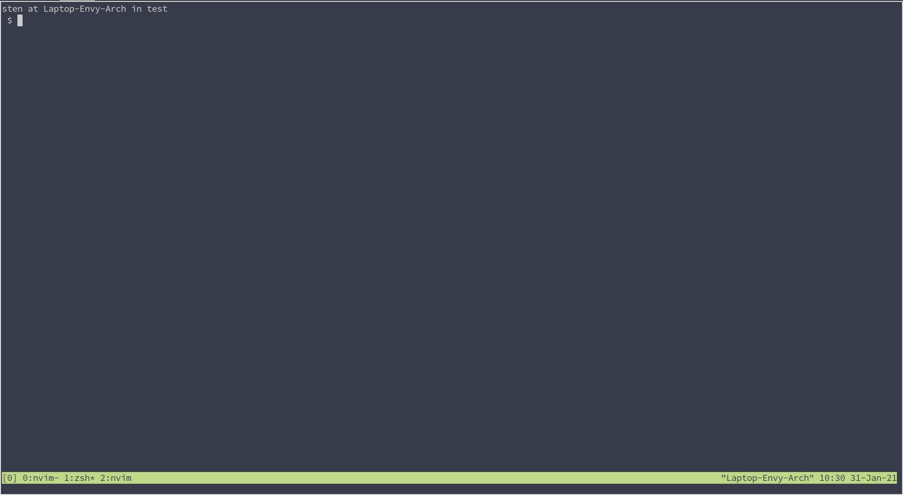

# fits.nvim
NeoVim plugin to make it possible to work with FITS files from inside NeoVim

## Installation
Requires: 
- Nightly version of NeoVim
- astropy

```bash
pip install --user astropy
```

Then you can install the plugin using your favorite plugin manager, i.e.:
```viml
Plug 'StenSipma/fits.nvim'
```

## Usage
Currently, there is one command (`FitsInspect`) which is able to display
information of a FITS file and access the individual headers of each HDU.
Simply call it with a valid FITS file as its argument and you will see the info
menu. Move your cursor over one of the HDU's and press `Enter` to see the
header of that HDU. Closing the header window, or the info window is done with `q`


